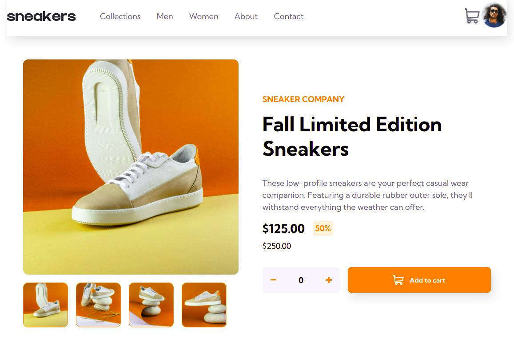

# Frontend Mentor - E-commerce product page solution

This is a solution to the [E-commerce product page challenge on Frontend Mentor](https://www.frontendmentor.io/challenges/ecommerce-product-page-UPsZ9MJp6). Frontend Mentor challenges help you improve your coding skills by building realistic projects.

## Table of contents

- [Overview](#overview)
  - [Screenshot](#screenshot)
  - [Built with](#built-with)
  - [What I learned](#what-i-learned)
- [Author](#author)

## Overview
This is a frontend mentor project built with CSS and JavaScript. 

### The challenge

The challenge was to create a responsive e-commerce page. You should be able to view the following: 

- View the optimal layout for the site depending on their device's screen size
- See hover states for all interactive elements on the page
- Open a lightbox gallery by clicking on the large product image
- Switch the large product image by clicking on the small thumbnail images
- Add items to the cart
- View the cart and remove items from it

### Screenshot

### Built with

- CSS custom properties
- Semantic HTML5 markup
- Flexbox
- CSS Grid

### What I learned
I learnt plenty of CSS concepts, but a new concept I learnt from this project was how to create a lightbox element. Generally, the project had enough elements that required JavaScript functionality, which was excellent for my learning process. 

## Author

- Website - Catherine Kiiru
- Twitter - [@yourusername](https://www.twitter.com/CatherineKiiru)
